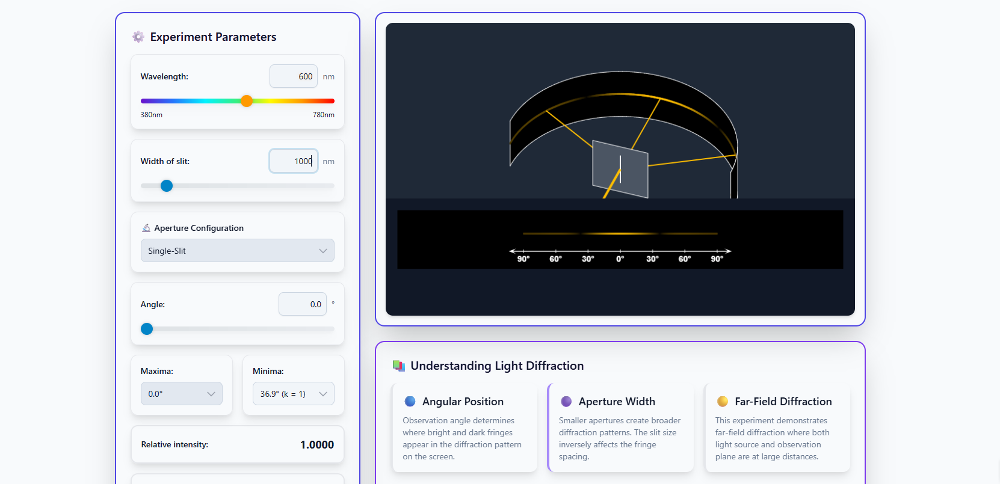

**Step 1:** Set the width of the slit. Keep this value constant throughout the experiment.
 <b>Given:</b> Slit width <i>d</i> = 0.1 mm = 1 &times; 10&minus;4 m

**Step 2:** Click on "Diffraction Pattern" or "Intensity Profile" option to observe the diffraction pattern as shown in Fig. 3.

**Step 3:** Change the value of angle of observation (&theta;) corresponding to the first-order minimum (<i>k</i> = 1).

**Step 4:** Repeat the process 5 times for different angles of observation. Take the average of the values of &lambda;.

<figure>
  
  <figcaption><strong>Fig. 3:</strong> Diffraction Pattern of Single-Slit</figcaption>
</figure>

**Step 5:** Calculate the wavelength (&lambda;) for each observation using the formula:

  d &nbsp;sin&theta; = k&lambda;
  &nbsp;&nbsp;&nbsp;&rArr;&nbsp;&nbsp;&nbsp;
  &lambda; = d &times; sin&theta; / k

Where:
<ul>
  <li><i>d</i> &mdash; width of the slit</li>
  <li><i>&theta;</i> &mdash; angle of observation at kth minimum</li>
  <li><i>k</i> &mdash; order of minima (k = 1 for first-order minimum)</li>
  <li><i>&lambda;</i> &mdash; wavelength to be calculated</li>
</ul>

**Observation Table:**

<i>Given: d = 0.1 mm = 1 &times; 10&minus;4 m, &nbsp; k = 1</i>

| Serial No. | Angle of Observation (&theta;) | sin&theta; | Wavelength &lambda; = d &times; sin&theta; / k |
|:----------:|:------------------------------:|:----------:|:----------------------------------------------:|
| 1 | 0.360° | 0.006283 | 628.3 nm |
| 2 | 0.363° | 0.006336 | 633.6 nm |
| 3 | 0.362° | 0.006318 | 631.8 nm |
| 4 | 0.365° | 0.006371 | 637.1 nm |
| 5 | 0.361° | 0.006301 | 630.1 nm |

**Average Wavelength:**

  &lambda;avg = (628.3 + 633.6 + 631.8 + 637.1 + 630.1) / 5
   
  &lambda;avg = 3160.9 / 5
   
  <b>&lambda;avg = 632.2 nm</b>

<b>Standard value of He&ndash;Ne laser wavelength = 632.8 nm</b> 
<b>Percentage Error = |(632.8 &minus; 632.2) / 632.8| &times; 100 &asymp; 0.09%</b>

