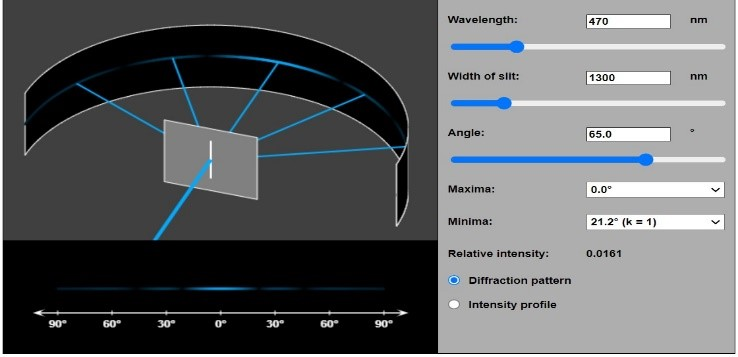
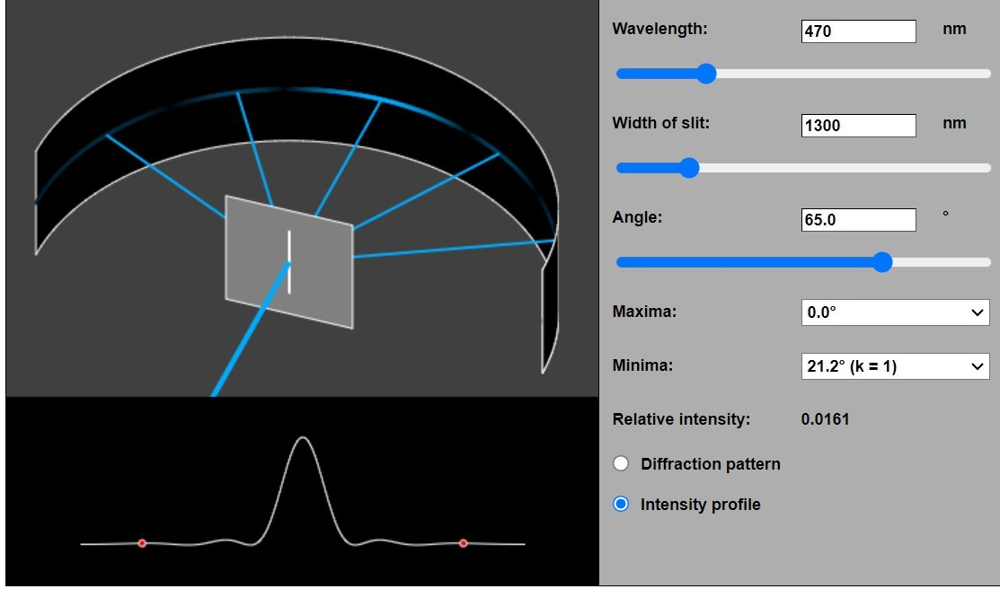

Step1: set the value of wavelength, angle and width of the slit 
Step2: Click on diffraction pattern or Intensity Profile 
Step 3: When click on diffraction pattern the pattern appearing on the left side bottom will be seen due to single slit aperture. 
 
Step 4: If Intensity profile is clicked then the pattern seen is as shown below in Fig.3. Bottom left if the value of k is set to 1 then it will show two intensity profiles. 
 
Step5: Change wavelength and change the thickness to see the different pattern formation. This will give sense of understanding how the pattern changes by changing the parameters on which it depends. 
Take 5-10 readings of each value from experiment and record them in table. 
<table style="width:100%">
<tr>
<th style="width:0.5%" >Experiment no.</th>
<th style="width:20%">Aperture Width/thickness(e or diameter)</th>
<th style="width:20%">Angle of observation(theeta)</th>	
<th style="width:20%">Order(k)</th>
</tr>
<tr>
<th></th>
<th></th>
<th></th>
<th></th>
</tr>
<tr>
<th></th>
<th></th>
<th></th>
<th></th>
</tr>
<tr>
<th></th>
<th></th>
<th></th>
<th></th>
</tr>
<th></th>
<th></th>
<th></th>
<th></th>
</tr>
</tr>
<th></th>
<th></th>
<th></th>
<th></th>
</tr>
</tr>
<th></th>
<th></th>
<th></th>
<th></th>
</tr>
</tr>
<th></th>
<th></th>
<th></th>
<th></th>
</tr>
</tr>
<th></th>
<th></th>
<th></th>
<th></th>
</tr>
</tr>
<th></th>
<th></th>
<th></th>
<th></th>
</tr>
</tr>
<th></th>
<th></th>
<th></th>
<th></th>
</tr>
</table>

