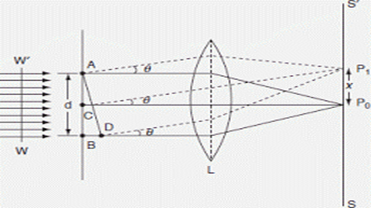
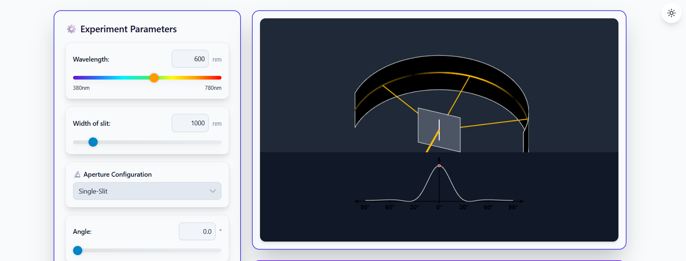

Light exhibits wave nature, and one important consequence of this is diffraction — the bending and spreading of light when it passes through a narrow aperture. When a monochromatic source such as a He–Ne laser passes through a single narrow slit, a characteristic diffraction pattern is formed on a screen.

The He–Ne laser emits nearly monochromatic red light of wavelength approximately <b>632.8 nm</b>, making it ideal for diffraction experiments because it produces sharp and well-defined patterns.

Let a parallel beam of monochromatic light of wavelength <b>&lambda;</b> be incident normally upon a narrow slit AB of width <b>d</b>, where it gets diffracted as shown in Fig. 1. If a lens L is placed in the path of the diffracted beam, a real image of the diffraction pattern is formed on the screen SS&prime; in the focal plane of the lens.

<figure style="text-align:center;">
  
  <figcaption style="text-align:center;"><strong>Fig. 1:</strong> Single-slit Fraunhofer diffraction setup</figcaption>
</figure>

<b>Path Difference:</b>

  BD = AB sin&theta; = d sin&theta; &emsp;&emsp; &hellip; (1)

The corresponding phase difference:

  &phi; = (2&pi; / &lambda;) &times; path difference = (2&pi; / &lambda;) &times; d sin&theta; &emsp;&emsp; &hellip; (2)

Now, consider the width AB of the slit divided into <i>n</i> equal parts. Each part forms an elementary source. The amplitude of vibration at P0 due to the wave from each part will be the same, and the phase difference of waves from any two consecutive parts is:

  e = (1/n) &times; (2&pi; / &lambda;) &times; d sin&theta;

Hence, the resultant amplitude at P0 is given by:

  A = [ a &times; sin(ne/2) ] / sin(e/2) &emsp;&emsp; &hellip; (3)

Since the magnitude of intensity at any point in the focal plane of the lens is a function of <i>a</i> and <i>&theta;</i>, we obtain a series of maxima and minima.

<b>Condition for a maximum (approximation):</b>
<ul>
  <li>&theta; = 0&deg; &nbsp;or&nbsp; d sin&theta; &asymp; (k + &frac12;) &lambda;</li>
  <li><i>d</i> &mdash; width of slit</li>
  <li><i>&theta;</i> &mdash; angle of diffraction</li>
  <li><i>k</i> &mdash; order of the maximum (0, 1, 2, 3, &hellip;)</li>
  <li><i>&lambda;</i> &mdash; wavelength</li>
</ul>

<b>Condition for a minimum:</b>
<ul>
  <li>&theta; &gt; 0&deg;, &nbsp; d sin&theta; = k&lambda;</li>
  <li><i>d</i> &mdash; width of slit</li>
  <li><i>&theta;</i> &mdash; angle of diffraction</li>
  <li><i>k</i> &mdash; order of the minimum (1, 2, 3, &hellip;)</li>
  <li><i>&lambda;</i> &mdash; wavelength</li>
</ul>

Fraunhofer diffraction is shown in Fig. 2, which explains how light waves spread and form patterns (bright/dark fringes) when passing through a slit under conditions where the source and screen are effectively at infinite distances.

<figure style="text-align:center;">
  
  <figcaption style="text-align:center;"><strong>Fig. 2:</strong> Fraunhofer single-slit diffraction pattern showing intensity distribution</figcaption>
</figure>
