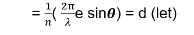
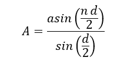
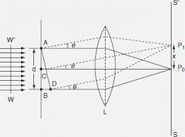
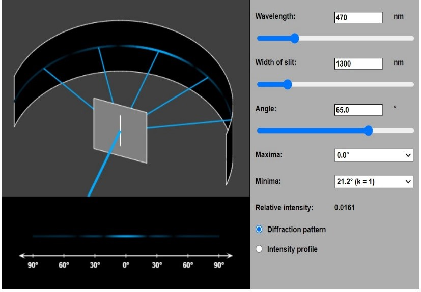

Light behaves not only like a wave but also like a particle. One consequence of this wave nature is diffraction, where light bends slightly as it travels around the edges of an object. Fraunhofer diffraction, a specific type of diffraction, occurs when parallel light waves from a distant source pass through a small opening or diffracting object, and the resulting pattern is observed on a screen at a far distance. This distant observation is crucial for the characteristics of Fraunhofer diffraction.

In Fraunhofer diffraction the source and the screen are a infinite distance from the obstacle and the wavefront is plane. Let a parallel beam of monochromatic light of wavelength be incident normally upon a narrow-slit AB of width e where it gets diffraction in below fig. if a lens L is placed in the path of the diffraction beam, a real image of the diffraction pattern is formed on the screen MN in focal plane of the lens. BE= AB sin𝜃= e sin𜃠 
The corresponding phase difference= (2𝜋/ λ) *path difference 
      = (2𝜋/ λ) * (e sin𝜃)  
Now, consider the width AB of the slit divided into n equal parts. Each part forms an elementary source. The amplitude of vibration at P due to the wave from each part will be the same, and the phase difference the waves from any two consecutive parts is, 
 
Hence, resultant amplitude at P is given by,  
 
Since, the magnitude intensity at any point in the focal plane of the lens is a function of 𝒂 and 𝜽.so, we obtain a series of maxima and minima.  
Condition for a maximum (approximation): 
1. α = 0°   or   b sin α  ≈  (k + ½) λ  
2. b ... width of slit 
3. α ... angle 
4. k ... order of the maximum (1, 2, 3, ...) 
5. λ ... wavelength 
Condition for a minimum: 
1. b sin α  =  k λ 
2. b ... width of slit 
3. α ... angle 
4. k ... order of the minimum (1, 2, 3, ...) 
5. λ ... wavelength 
 
Fig. 1 
 
Fig.2 